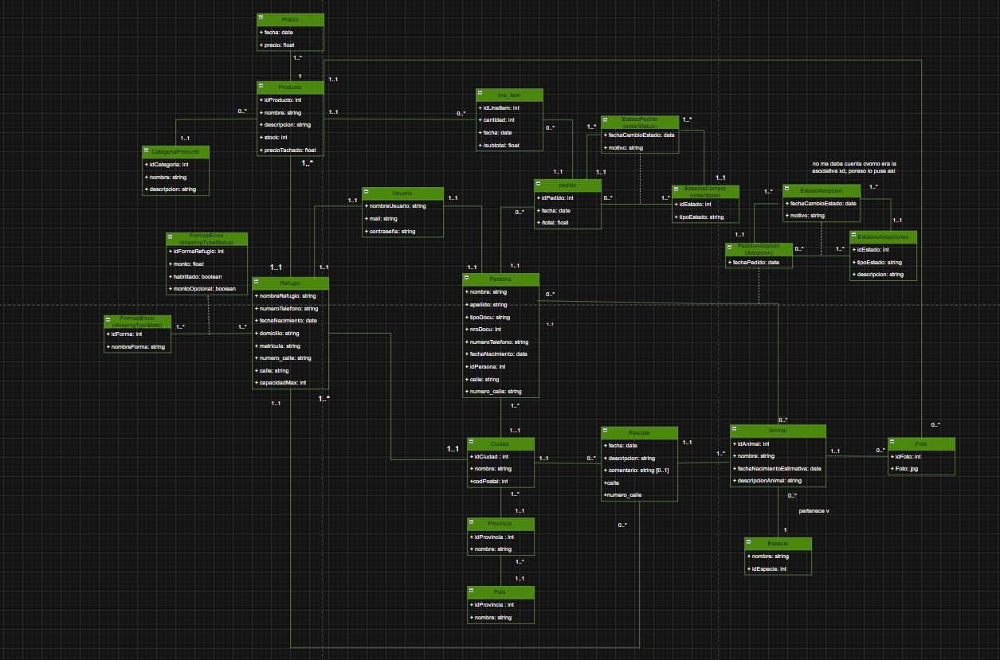

# Propuesta TP DSW

## Grupo
### Integrantes
* 46338 - Peresin, Tomás Ignacio
* 51441 - Melgarejo, Julia Ayelen

### Repositorios
* [fullstack app](https://github.com/JuliaMelgarejo/TP-DSW)

## Tema
### Descripción
“Patas Alegres” es una plataforma digital para gestionar procesos de adopción de animales, orientada a refugios y adoptantes. Permite administrar animales disponibles, usuarios y estados de adopción de forma centralizada. El sistema facilita la evaluación de solicitudes, promoviendo una adopción responsable y transparente. Se desarrolla bajo una arquitectura cliente-servidor con tecnologías web modernas. Incluye funcionalidades de autenticación, control de acceso y testing automatizado. Su objetivo es generar impacto social positivo reduciendo el abandono animal y fomentando la adopción.

### Modelo

## Alcance Funcional 

### Alcance Mínimo

Regularidad:

|Req|Detalle|
|:-|:-|
|CRUD simple|1. CRUD Especie 2. CRUD Veterinaria 3. CRUD Persona 4. CRUD Zona|
|CRUD dependiente|1. CRUD Animal {depende de} CRUD Especie y CRUD Refugio 2. CRUD Refugio {depende de} CRUD Zona|
|Listado + detalle|1. Listado de animales filtrados por especie o refugio => detalle muestra los datos completos del animal|
|CUU/Epic|1. Adopción de un animal 2. Login de usuario|

---

### Adicionales para Aprobación

|Req|Detalle|
|:-|:-|
|CRUD|1. CRUD Adopciones 2. CRUD Historial De estados de adopciones 3. CRUD Estados de adopciones 4. CRUD Animal 5. CRUD Especie 6. CRUD Pedido 7. CRUD Historial de estados de pedido  8. CRUD Estados de pedido  9. CRUD Persona  10.CRUD Producto  11. CRUD Foto  12. CRUD Precio  13. CRUD Categoria de producto  14. CRUD Rescate  15. CRUD Refugio  16. CRUD Usuario  
|CUU/Epic|1. Registrarse en la plataforma 2. Iniciar sesión 3. Ver listado de animales disponibles 4. Filtrar o buscar animales 5. Ver detalle de un animal 6. Postularse para adoptar un animal 7. Consultar estado de solicitud de adopción 8. Crear, editar y eliminar animales 9. Cargar información del animal (edad, raza, estado, etc.) 10. Gestionar solicitudes de adopción 11. Aprobar o rechazar postulaciones 12. Cambiar estado de adopción (pendiente, aprobado, entregado, etc.) 13. Administrar usuarios 14. Ver animales del refugio 15. Actualizar información básica de animales 16. Colaborar en el seguimiento de adopciones|

### Alcance Adicional Voluntario

|Req|Detalle|
|:-|:-|
|Listados |1. Adopciones específicas filtradas por animales de ese refugio  2. Adopciones filtradas por usuario con detalle del estado de la solicitud de adopción  3. Animales filtrados por refugio  4. Refugios filtrados por cercanía de zona  5. Productos de cada refugio  6. Pedidos de cada persona  7. Productos en el carrito |
|CUU/Epic|1. Postularse para adoptar un animal  2. Consultar estado de una solicitud de adopción  3. Comprar productos para mascotas  4. Agregar productos al carrito  5. Realizar un pedido de productos  6. Cancelar un pedido o solicitud de adopción |
|Otros|1. Localización mediante google-maps  2. Encriptación de datos sensibles con bcrypt  12. autorización mediante JWT |

### Cosas a mejorar:
Una vez finalizado el desarrollo de la aplicación, identificamos diversas oportunidades de mejora que podrían incorporarse en futuras versiones del sistema.

En primer lugar, sería posible ampliar las funcionalidades del módulo de comercio electrónico incorporando opciones de envío a domicilio y retiro en el local (take-away), lo que brindaría mayor flexibilidad a los usuarios al momento de adquirir productos.

Asimismo, se podrían implementar validaciones adicionales tanto en el frontend como en el backend, con el objetivo de fortalecer la robustez y confiabilidad de la aplicación, garantizando una mejor experiencia de uso y una mayor integridad de los datos.

Por último, una mejora relevante sería la integración de un sistema de pagos funcional que permita realizar transacciones mediante tarjetas de crédito o débito. Alternativamente, también podría contemplarse la integración con plataformas de pago externas, como la API de Mercado Pago, para gestionar pagos de manera segura y eficiente.

Estas mejoras representan posibles líneas de evolución del sistema que podrían implementarse en etapas futuras del proyecto.